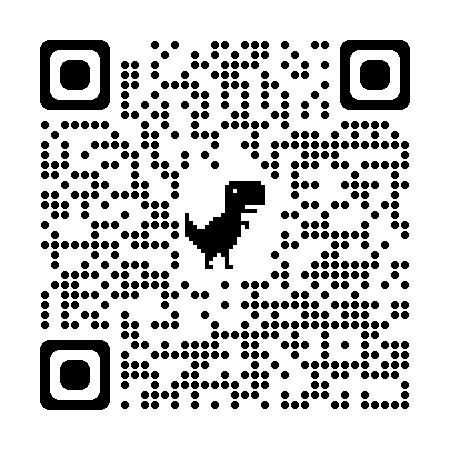

# Make Your Own Artificial Intelligence Driven Web App to Decorate Faces

The app will capture video and then apply artificial intelligence to decorate your face.



Make your own with [REPLIT.com](https://replit.com/@apatterson189/face-decoration)


## Create Your Own

create your own decortion and code to position it!

### Create Your Decoration

1. Create a png image to use as the decoration. Any app that allows you to create png files will work fine. The default decoration uses Google Drawings to make simple [sunglasses](https://docs.google.com/drawings/d/1k2MwpDjihT9NPSYpl2-Tn-whb9s2UMe-R5D7QDCNZAs/edit?usp=sharing). A few options:
   1. [Google Drawings](https://docs.google.com/drawings)
   1. [Sketchpad](https://sketch.io/sketchpad/)
   1. [Figma](https://www.figma.com/)
   1. etc...
1. replace the image at "edit/decoration.png" with your new decoration.

### Code Your Logic to Position the Decoration

update "edit/get_draw_props.js" to correctly calculate the drawing properties for your decoration. - the face parameter includes data like the following:

#### Keypoints (JSON)

```json
{
  "keypoints": [
    { "x": 141, "y": 61, "name": "rightEye" },
    { "x": 180, "y": 64, "name": "leftEye" },
    { "x": 167, "y": 80, "name": "noseTip" },
    { "x": 162, "y": 103, "name": "mouthCenter" },
    { "x": 105, "y": 76, "name": "rightEarTragion" },
    { "x": 189, "y": 81, "name": "leftEarTragion" }
  ],
  "box": {
    "xMin": 104,
    "xMax": 198,
    "yMin": 42,
    "yMax": 135,
    "width": 93,
    "height": 93
  }
}
```

#### Keypoints Identified


Based on the face keypoints, calculate the following to position the decoration

- xCenter: the x coordinate of the center of the decoration
- yCenter: the y coordinate of the center of the decoration
- width: the width of the decoration
- height: the height of the decoration
- angle: the angle of the decoration

#### Draw Properties


You can use the provided example images and video to check if your calculation is correct
